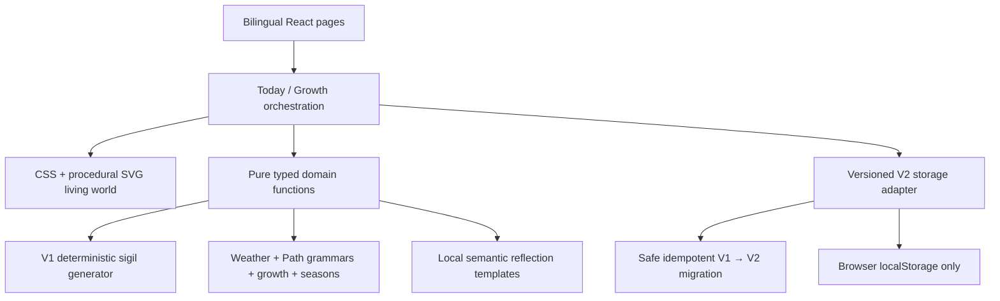

# Ninefold V2 · 九境生息

> **A place that grows when you return.**  
> **一片因你的归来而生长的风景。**

Ninefold V2 is a local-first, bilingual symbolic reflection experience built around a persistent living landscape. A daily return shapes weather, adds a procedural **Daily Sigil / 今日印记**, and leaves a visible trace in **The Ninefold World Tree / 九境之树**.

The official Simplified Chinese product name is **九境生息**. `九境之树` names the World Tree visual IP; it is not an alternative product name.

Ninefold is intentionally bounded:

- no external AI model or OpenAI API;
- no paid API or weather service;
- no account, authentication or database;
- no cloud sync, analytics, cookies or device fingerprinting;
- no streaks, levels, coins or missed-day punishment; and
- no diagnostic, counselling, medical, legal, financial, relationship-prediction or fortune-telling claim.

Ninefold is a deterministic symbolic reflection experience. It is not described as AI-powered.

## Product definition

**English:** A living inner landscape shaped by how you return each day.  
**中文：** 一个随着你每日归来而缓慢生长的内在世界。

The product promise is **“Return for a moment. Leave something growing.” / “回来片刻，留下一点生长。”**

The World Tree gives the existing deterministic product continuity:

- roots hold accumulated history and memory;
- the lower trunk expresses the stable Path identity;
- new branches and environmental details record daily growth;
- weather visualises current state without judging it as good or bad;
- the Daily Sigil carries the day’s number, colour and form into the landscape;
- reflected water supports memory and an alternate viewing angle; and
- the nebula canopy represents long-term integration.

Approved project-owned visual assets are kept at:

- source reference: `reference/ninefold-world-tree-ip.png`;
- optimised production key art: `public/brand/ninefold-world-tree-key-art.webp`.

The key art leads the landing page and supplies the colour/atmosphere reference. The interactive product remains a layered CSS/SVG world rather than a single static background.

## Experience loop

The V2 loop is:

1. **Arrive / 归来** — return to the persistent landscape.
2. **Attune / 感知** — describe Energy, Clarity, Connection and Focus.
3. **Tend / 照料** — choose one non-ranked care action.
4. **Grow / 生长** — watch the day’s weather and sigil join the world.
5. **Reflect / 回望** — receive one concise reflection, action and question.
6. **Rest / 停留** — let the interface recede for 30 seconds, one minute or an open-ended pause.
7. **Return / 再次归来** — add another trace without streak pressure or decay.

The product formula is:

```text
Path                    = long-term growth grammar
Daily state             = today's weather
Care action             = the user's participation
Number, colour and form = today's trace
Time                    = accumulated memory
Language                = how the world speaks
```

## Product surfaces

### Landing

The World Tree key art, hero copy and two actions explain the product quickly: enter a landscape or inspect a deterministic sample week. The page also states that no account is required, data stays local, and the experience is reflective rather than predictive.

### Onboarding

Four steps preserve the V1 profile model while reframing it as a first planting:

1. optional display name;
2. one of nine Paths / 心径;
3. optional zodiac and preference lenses for wording and atmosphere only; and
4. a first-planting review with a local-data notice.

A Path is a growth grammar, not a rank, personality verdict or destiny.

### Today

Today is organised around Arrive, Attune, Tend, Grow, Reflect and Rest. The World Tree remains visually primary; detailed scores, evidence, symbols and reproducibility information sit behind **How today took shape / 今天如何成形**.

The Attune experience preserves the V1 values:

- Energy `1–5`;
- Clarity `1–5`;
- Connection: inward, balanced or outward;
- Focus: work, study, relationships, creativity or self; and
- an optional private note of at most 280 characters.

The two-dimensional sky control has matching keyboard-accessible rating controls. The growth transition uses a short fade under reduced motion. Rest mode is silent, can be exited at any time or with Escape, restores focus, and does not award or withhold anything.

### Growth

The former Archive route is presented as **Growth / 生长** with two modes:

- **Living View / 生长景观** — an accumulated World Tree with toggleable daily weather, care and sigil traces;
- **Memory View / 每日记忆** — dates, independent sigils, scores, themes, original/alternate status, feedback and full historical detail.

The seven-day composition and deterministic local weekly summary remain available. Sample data stays labelled, removable, deterministic and separate from real data. It never silently overwrites a real entry.

### Method

The Method page covers what Ninefold is, how the landscape grows, what shapes a day, deterministic generation, Path meaning, Daily Sigils, another viewing angle, explicit non-claims, local data and the future constrained-provider boundary. It also contains the owned-key-only clear-data control.

## Nine Path grammars

All Paths share the World Tree IP while changing silhouette, biome, branch/root structure, growth features and sigil merge targets. Paths 3 and 5 are structurally different, not parameter variants.

| Path | Name | Distinct living-world grammar |
| --- | --- | --- |
| 1 | Initiation / 启程 | Ascending central spire, single leading branch, forward root path, sunlit meadow |
| 2 | Connection / 联结 | Paired arcs, bridging branches, linked roots and converging streams |
| 3 | Expression / 表达 | Flowering radiance, petal branches, scattered seeds and outward colour |
| 4 | Structure / 构筑 | Tiered terraces, modular branches, geometric roots and ordered garden forms |
| 5 | Movement / 流动 | Wind-swept silhouette, forking ribbons, stream delta and off-centre motion |
| 6 | Care / 养护 | Sheltering canopy, enclosing branches, protected roots, nests, fruit and pools |
| 7 | Reflection / 沉思 | Mirrored depth, inward spiral, submerged roots, lake and star reflections |
| 8 | Realisation / 凝成 | Crystalline ascent, faceted nodes, mountain foundation and visible completion |
| 9 | Integration / 归一 | Seasonal circle joining roots, flowers, water, stars, renewal rings and nebula |

The typed definitions live in `src/domain/pathGrammars.ts` and are exposed through `getPathGrammar`, `listPathGrammars` and stable structural signatures.

## Weather and care

`deriveWeatherState` maps the check-in into normalised `0–1` visual values for sky clarity, cloud density, rain, wind, sunlight and stars. Connection supplies the motion bias, Focus supplies the environmental motif, and local time supplies only a broad morning/day/evening/night atmosphere. No location or weather API is used.

| Input | Visual effect |
| --- | --- |
| Lower Energy | still air, softer light and limited motion |
| Higher Energy | stronger calm movement, more active leaves/particles |
| Lower Clarity | haze, denser cloud and shorter visual distance |
| Higher Clarity | open horizon, clearer water and more visible distance |
| Inward Connection | motion gathers toward roots, trunk and centre |
| Balanced Connection | centre and horizon remain in equilibrium |
| Outward Connection | branches, seeds and light travel toward the edges |
| Work / Study / Relationships / Creativity / Self | structure / stars / connection / bloom / roots-and-shelter motifs |

The care action is a user choice, never a recommendation:

| Care action | Chinese | Permitted growth emphasis |
| --- | --- | --- |
| Nourish | 滋养 | branches, canopy, leaves, flowers and fruit |
| Release | 放下 | released layers and more open sky |
| Protect | 守护 | canopy, shelter and root enclosure |
| Open | 敞开 | branch reach, open sky, bridge/path direction |
| Observe | 观照 | reflection clarity and star presence without forced structural growth |

The pure growth layer prevents a care action from changing fields outside its declared boundary.

## Daily Sigil and another angle

The V1 procedural geometric generator remains the source of the **Daily Sigil / 今日印记**. A typed `PatternConfiguration` contains the deterministic seed, daily number, two colours, form, direction, symmetry, rotation, line weight, opacity, density and scores.

The sigil:

- appears independently as accessible SVG;
- merges into a Path-specific flower, fruit, branch node, root mark, water mark, bridge, crystal, constellation or nebula node;
- remains available in Memory View; and
- remains downloadable without private notes, profile ID, seed or unsafe user HTML.

**View from another angle / 换个角度看** preserves the same date, check-in, daily number, Path and scores. It deterministically changes only the permitted viewpoint, palette/form emphasis and composition. It is available once per day, keeps both saved views, and never promises a better result.

## Retained V1 foundation

V2 evolves the working application in place. It retains:

- Vite, React, TypeScript and HashRouter;
- responsive landing and four-step onboarding;
- Path identities 1–9 and optional zodiac/preference lenses;
- Energy, Clarity, Connection, Focus and the optional 280-character note;
- seeded date/profile generation and the versioned symbolic dictionary;
- procedural SVG art, daily number, colours, form and direction;
- Clarity, Momentum and Tension compositional signals;
- `ReflectionProvider` and `LocalReflectionProvider` abstractions;
- evidence, tension, opportunity, action and reflection question;
- one deterministic daily Reframe and original/alternate switching;
- seven-day history, weekly composition and historical detail;
- deterministic sample-week loading/removal safety;
- Daily Sigil and weekly SVG downloads, safe sharing and local feedback;
- local persistence, corruption recovery and explicit data clearing; and
- keyboard, focus, reduced-motion and responsive foundations.

V2 changes their hierarchy: the landscape is primary, symbols become growth material, reflection is a quiet second layer, Growth is memory, and another angle is a change of view rather than a reroll.

## Bilingual architecture

English and Simplified Chinese are first-class routes:

| English | 简体中文 |
| --- | --- |
| `#/en/` | `#/zh/` |
| `#/en/onboarding` | `#/zh/onboarding` |
| `#/en/today` | `#/zh/today` |
| `#/en/archive` | `#/zh/archive` |
| `#/en/about` | `#/zh/about` |

`/method` remains a compatibility alias that redirects to `/about` in the active locale.

The persistent `中文 | EN` control:

- is fixed at the bottom-right on desktop and mobile;
- includes safe-area spacing and approximately 44px targets;
- shows the active locale without using flags or `ZH`;
- maps to the equivalent route and preserves App-owned profile, entries, landscape and deterministic output;
- does not intentionally regenerate the seed, sigil, scores, weather, growth or Reframe; and
- persists the locale while safely defaulting to English when no route, stored choice or Chinese browser preference is available.

Route-level copy is typed by `TranslationDictionary` and supplied through:

```text
src/i18n/types.ts
src/i18n/en.ts
src/i18n/zh-CN.ts
src/i18n/I18nProvider.tsx
src/i18n/useTranslation.ts
src/i18n/formatters.ts
src/i18n/routing.ts
```

Dates use `Intl.DateTimeFormat`, and the provider updates `document.documentElement.lang` to `en` or `zh-CN`. Reflection uses shared semantic inputs with independently authored English and Chinese templates; language switching never regenerates the underlying configuration.

The Chinese terminology and editorial review record is maintained at [`audits/chinese-copy-audit.md`](audits/chinese-copy-audit.md).

## Architecture



Key boundaries:

- `src/pages/` owns route-level flow and landmarks.
- `src/components/landscape/` owns sky, weather, ground, water, World Tree, Path growth, sigil merge, Attune, care and Rest rendering.
- `src/domain/` owns deterministic generation, grammars, weather, growth, seasons, reflection, migration and storage validation.
- `src/i18n/` owns typed dictionaries, route mapping, locale persistence and date formatting.
- `src/styles.css`, `src/v2.css` and `src/living-world.css` own central tokens, layout and reduced-motion behaviour.

Pure V2 functions include:

- `deriveWeatherState(...)`;
- `getPathGrammar(...)`;
- `createGrowthEventFromDailyEntry(...)`;
- `applyGrowthEvent(...)`;
- `composeLivingLandscape(...)`;
- `deriveSeasonVisualState(...)`;
- `migrateV1ToV2(...)`; and
- `formatReflectionForLocale(...)`.

No random selection occurs inside React render. Persisted outcomes continue to use the seeded generator.

## Deterministic reflection

The original `ReflectionProvider` and `LocalReflectionProvider` remain intact. V2 adds `formatReflectionForLocale`, which accepts a validated DailyEntry, GrowthEvent or semantic input and formats the same Path/check-in/configuration through independently authored language templates.

Changing locale does not alter:

- seed or generator version;
- date, Path or daily number;
- colour, form, direction or scores;
- care action, weather or season;
- original/Reframe relationship; or
- saved growth history.

The output remains a `ReflectionOutput` with theme, two evidence lines, tension, opportunity, action, question and safety disclaimer. No remote inference occurs.

## V2 storage and V1 migration

The current adapter uses versioned keys beneath `ninefold:v2:`:

```text
ninefold:v2:profile
ninefold:v2:check-ins
ninefold:v2:entries
ninefold:v2:feedback
ninefold:v2:sample-week
ninefold:v2:landscape
ninefold:v2:migration
```

On first V2 access, the adapter detects valid `ninefold:v1:` envelopes and runs a non-destructive migration. It preserves the profile, check-ins, dates, original/Reframe relationship, feedback and sample state; compatible daily entries become GrowthEvents. Because V1 had no care action, migrated real entries use a transparent neutral `observe` default marked as `migrated-default`.

Migration is:

- validated record by record;
- recoverable when a partial record is corrupt;
- fingerprinted with a migration marker;
- idempotent, with existing V2 dates winning on retry; and
- non-destructive: V1 data is not silently erased after migration.

The clear-data action is explicit and confirmed. It removes only Ninefold-owned `ninefold:v1:` and `ninefold:v2:` keys; unrelated browser storage is untouched.

## Privacy and export

Personal content never leaves the browser. Ninefold does not collect or transmit email, phone, exact birth date, precise location, profile, check-in, private note, feedback, analytics identifiers or device fingerprints.

Private notes are excluded from:

- Daily Sigil SVG;
- weekly composition SVG;
- safe share captions; and
- Web Share/clipboard fallbacks.

Exports also exclude profile ID, deterministic seed, storage internals and hidden debug data. The production key art is a bundled local static asset.

## Accessibility and responsive design

The implementation targets:

- one `h1` per route and logical heading order;
- visible focus and keyboard-operable navigation;
- keyboard alternatives for the Attune field;
- Escape handling, focus containment and focus restoration for dialogs and Rest mode;
- route and growth status announcements;
- approximately 44px minimum touch targets;
- meaningful Daily Sigil/World Tree titles and descriptions;
- a non-visual description of the living landscape;
- no meaning conveyed by colour alone;
- updated document language and translated ARIA copy;
- no keyboard trap or horizontal page overflow; and
- complete information with `prefers-reduced-motion: reduce`.

Layouts are mobile-first. The final local browser pass reviewed representative English and Chinese routes at 375px, 768px, 1024px and 1440px with one `h1`, no horizontal page overflow and usable touch targets. Desktop space adds atmosphere rather than dashboard density.

## Visual system and performance

The living world uses three lightweight depth layers:

1. sky, nebula, clouds, light and distant ridges;
2. World Tree, water, Path structures and daily traces;
3. grass, flowers, weather marks and restrained foreground motion.

The implementation uses CSS gradients, typed SVG geometry, system-first fonts and the optimised WebP key art. It does not use WebGL, a 3D engine, a large component framework, a large animation package, external stock imagery or automatic audio.

Animations are bounded and CSS-driven. Reduced motion collapses looping movement and transitions without removing content, and non-essential movement pauses while the browser tab is hidden.

## Local development

Requirements:

- Node.js `>=20.19.0`;
- pnpm `11` (the package declares `pnpm@11.7.0`).

Install:

```bash
pnpm install
```

Run the development server:

```bash
pnpm dev --host 127.0.0.1 --port 5173 --strictPort
```

Open `http://127.0.0.1:5173/#/en/` or `http://127.0.0.1:5173/#/zh/`.

Lint:

```bash
pnpm lint
```

Test:

```bash
pnpm test
```

Watch tests while developing:

```bash
pnpm test:watch
```

Build the static production output:

```bash
pnpm build
```

Preview `dist/` locally:

```bash
pnpm preview --host 127.0.0.1 --port 4173 --strictPort
```

The test suite covers V1 determinism and Reframe, bilingual routing/dates/dictionary parity, distinct Path grammars, deterministic weather and composition, care-action boundaries, no absence decay, migration preservation/idempotence, V2 storage ownership, Rest focus/Escape, keyboard Attune, sharing privacy, sample safety and app smoke flows.

## GitHub Pages readiness

The project is ready for a future static host but this revision does **not** deploy anything.

- Vite emits self-contained static `dist/` output.
- `base: './'` keeps assets relative for localhost, repository subpaths and a future custom domain.
- HashRouter avoids server rewrite requirements.
- There is no server runtime, API route, secret or required environment variable.
- No deployment workflow is created or enabled here.

A future deployment should run the same lint, test and build gates before publishing `dist/`. Repository/subpath configuration remains a separate authorised task.

## Screenshot and review artifacts

Browser QA screenshots belong outside production output beneath the gitignored `artifacts/screenshots/` directory. The required review paths are:

```text
artifacts/screenshots/en-landing-1440.png
artifacts/screenshots/zh-landing-375.png
artifacts/screenshots/en-today-after-growth-1440.png
artifacts/screenshots/zh-today-after-growth-375.png
artifacts/screenshots/living-view-1440.png
artifacts/screenshots/rest-mode-375.png
```

All six files were captured and reviewed during the final local browser pass on 14 July 2026. The pass also covered onboarding, Today, Growth, Method, Reframe, Rest mode, sample loading/removal, clear-data confirmation, keyboard focus restoration and equivalent-route language switching.

## Known limitations

- Data is intentionally browser-local; there is no account recovery or cross-device sync.
- Clearing site storage outside Ninefold also removes the landscape because no remote copy exists.
- The interactive world is expressive CSS/SVG rather than free-camera 3D.
- Rest mode is deliberately silent; no original local audio layer ships in this version.
- Daily Sigil and seven-day SVG export are implemented; a dedicated full Living View SVG export remains future work.
- Non-essential CSS animation respects reduced motion and is paused whenever the browser tab is hidden.
- Interactive landscape, Rest and Growth/Memory copy now comes from typed central dictionaries. Direction grammar variants and reflection-template breadth still require the human editorial review recorded in `audits/chinese-copy-audit.md`; share-caption enum localization and the canonical Chinese colour palette are type-checked and covered by automated tests.

## Future generative-provider boundary

The provider interface could support a future **explicitly opt-in** generative wording layer, but it must remain downstream of the same deterministic semantic variables, privacy controls, safety claims and locale-independent configuration. Such a provider is not included, configured or required by this build.
